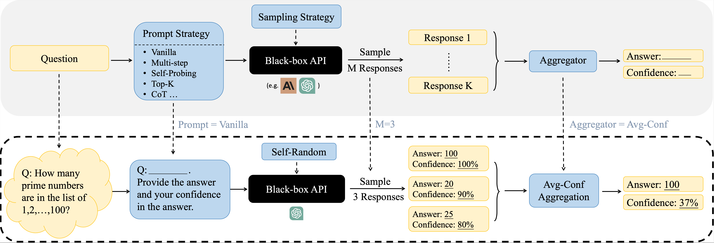

Can LLMs Express Their Uncertainty? An Empirical Evaluation of Confidence Elicitation in LLMs
==
Code for the paper "Can LLMs Express Their Uncertainty? An Empirical Evaluation of Confidence Elicitation in LLMs"

Paper: https://openreview.net/forum?id=gjeQKFxFpZ

Authors: [Miao Xiong](https://scholar.google.com/citations?user=yQ4U_5IAAAAJ&hl=en)$^\dagger$, [Zhiyuan Hu](https://zhiyuanhubj.github.io/)$^\dagger$, [Xinyang Lu](https://scholar.google.com/citations?user=BnzvlikAAAAJ&hl=en)$^\dagger$, [Yifei Li](https://openreview.net/profile?id=~YIFEI_LI3)$^\S$, [Jie Fu](https://bigaidream.github.io/)$^\ddagger$, [Junxian He](https://jxhe.github.io/)$^\ddagger$, [Bryan Hooi](https://bhooi.github.io/)$^\dagger$

$^\dagger$ National University of Singapore, $^\ddagger$ Hong Kong University of Science and Technology, $^\S$ EPFL - EPF Lausanne

## 01 Abstract

Empowering large language models (LLMs) to accurately express confidence in their answers is essential for reliable and trustworthy decision-making. Previous confidence elicitation methods, which primarily rely on *white-box access* to internal model information or model fine-tuning, have become less suitable for LLMs, especially closed-source commercial APIs. This leads to a growing need to explore the untapped area of *black-box* approaches for LLM uncertainty estimation. To better break down the problem, we define a systematic framework with three components: *prompting* strategies for eliciting verbalized confidence, *sampling* methods for generating multiple responses, and *aggregation* techniques for computing consistency. We then benchmark these methods on two key tasks—confidence calibration and failure prediction—across five types of datasets (e.g., commonsense and arithmetic reasoning) and five widely-used LLMs including GPT-4 and LLaMA 2. 
Our analysis uncovers several key insights: 1) LLMs, when verbalizing their confidence, tend to be overconfident, potentially imitating human patterns of expressing confidence. 2) As model capability scales up, both calibration and failure prediction performance improve, yet still far from ideal performance. 3) Human-inspired prompting strategies mitigate this overconfidence, albeit with diminishing returns in advanced models like GPT-4, especially in improving failure prediction. 4) Employing sampling strategies paired with specific aggregators can effectively enhance failure prediction; moreover, the choice of aggregator can be tailored based on the desired performance enhancement. Despite these advancements, all investigated methods struggle in challenging tasks, such as those requiring professional knowledge, indicating significant scope for improvement. We believe this study can serve as a strong baseline and provide insights for eliciting confidence in black-box LLMs.


## 02 Code Overview

To evaluate the uncertainty estimation ability of a method on a given dataset and model, we need to go through the following three steps:

1. `prompt_xx.py`: This script is used to prompt the Language Model (LLM) to generate corresponding responses. 

2. `extract_xx.py`: This script is used to extract the predicted answers of LLMs from the processed file generated by `prompt_xx.py`.

3. `vis_xx.py`: This script is used to visualize the output distribution based on the processed file generated by `extract_xxx.sh` and evaluate the performance of the entire dataset and obtain dataset-level metrics, such as Expected Calibration Error (ECE) and Area Under the Receiver Operating Characteristic Curve (AUROC).

- Prompt Strategy: 
  - prompt = `vanilla` or  `CoT` -> use `query_vanilla_or_cot.py`
  - prompt = `multistep` -> use `query_multistep.py`
  - prompt = `Top-K` -> consider `query_top_k.py`
  - prompt = `self_probing` -> consider `query_self_probing.py`

- Sampling Strategy:
  - `self_random` sampling which replies on model internal randomness: setting the `sampling_type` in `prompt_xx.py` to be `self_random`
  - `misleading` sampling which replies on input misleading hints as introduced noise: setting the `sampling_type` in `prompt_xx.py` to be `misleading`

- Aggregation Strategy:
  - all supported aggregation has been implemented in corresponding `vis_xx.py` scripts


## 03 Scripts and Hyperparameters

Next, we will introduce some sample scripts corresponding to different methods. In practical use, we only need to modify the parameters corresponding to each method in the scripts to reproduce the results.

### 3.1 Vanilla / Chain-of-Thought Verbalized Confidence 
- Prompt Strategy = Top-K
- Sampling Strategy: Self-random 
- Aggregation: no aggregation by setting `NUM_ENSEMBLE=1` to query LLM once; or you can specify the corresponding parameters to call different aggregators

This script `scripts/query_vanilla_verbalized.sh` is designed to run the vanilla and CoT verbalized confidence.

#### Parameters to Modify

Before running the script, ensure you modify the following parameters according to your requirements:

- `DATASET_NAME`: Name of the dataset. Example: `"GSM8K"`
- `MODEL_NAME`: Name of the model. Example: `"gpt4"`
- `TASK_TYPE`: Type of task. Here we support `"open_number_qa"` and `"multi_choice_qa"`. 
- `DATASET_PATH`: Path to the dataset file. Example: `"dataset/grade_school_math/data/test.jsonl"`
- `NUM_ENSEMBLE`: Number of sample size, i.e., how many times we want to query the LLM for the question. Example: `1`
- `USE_COT`: Decide whether to use COT or not. Example: `true`
- `TEMPERATURE`: Temperature parameter for LLM generation. Example: `0.0`


### 3.2 Top-k Prompting Based Verbalized Confidence 
- Prompt Strategy = Top-K
- Sampling Strategy: only query LLM once by setting `NUM_ENSEMBLE=1`
- No aggregation

This script `scripts/query_top_k_verbalized.sh` is designed to run the Top-k verbalized confidence. The users only need to modify a specific set of parameters to adapt the script to different datasets or models. The rest of the script remains unchanged. 

#### Parameters to Modify

Before running the script, ensure you modify the following parameters according to your requirements:

- `DATASET_NAME`: Name of the dataset. Example: `"GSM8K"`
- `MODEL_NAME`: Name of the model. Example: `"gpt4"`
- `TASK_TYPE`: Type of task. Here we support `"open_number_qa"` and `"multi_choice_qa"`. 
- `DATASET_PATH`: Path to the dataset file. Example: `"dataset/grade_school_math/data/test.jsonl"`
- `NUM_ENSEMBLE`: Number of sample size, i.e., how many times we want to query the LLM for the question. Example: `1`
- `USE_COT`: Decide whether to use COT or not. Example: `true`
- `TEMPERATURE`: Temperature parameter for LLM generation. Example: `0.0`
- `TOP_K`: Top K parameter. Example: `4`


### 3.3 Top-K Self-Consistency Confidence

This script `scripts/query_top_k_self_random.sh` is designed to run the Top-K Self-Consistency Confidence which uses temperature perturbation to generate multiple responses and every response is in top-k format.

### 3.4 Self-Probing Verbalized Confidence

This script `scripts/query_self_probing_self_random.sh` is designed to run the self-evaluate verbalized confidence.

#### Key Parameter to Modify

Before executing the script, ensure you adjust the following parameter:

- `DATASET_PATH`: This should be the foler where the question and the possible answer are computed. 
  Example: 
  ```
  DATASET_PATH="final_output/cot_verbalized_confidence/gpt4/GSM8K/GSM8K_gpt4_09-09-03-34_processed.json"
  ```
#### Other Parameters

While the primary focus is on the `DATASET_PATH`, users might also need to adjust other parameters based on their requirements:

- `DATASET_NAME`: Name of the dataset. 
- `MODEL_NAME`: Name of the model.
- `TASK_TYPE`: Type of task.
- `NUM_MISLEADING_HINTS`: Number of misleading hints, always set to be 0.
- `USE_COT`: Decide whether to use COT or not.


## 04 Things to Check when running the code

### Pre-execution Checklist
Before running the script, ensure the following: **Parameter Settings**: Confirm that the parameters are set correctly.
    - **COT Usage**: Decide if you're using COT or not.
    - **Num Ensemble**: Set `num_ensemble` to either `1` or `5`. For consistency, use `5`, and for verbalized, use `1`.


## 05 Extend the code to other datasets and models

Currently, the project supports the following datasets:
- Commonsense: SportsUnderstanding, StrategyQA
- Math: GSM8K, SVAMP
- Symbolic: DateUnderstanding, ObjectCounting
- Law: ProfessionalLaw
- Ethics: Business Ethics

Models:
- GPT: GPT3, GPT4, GPT3.5
- Vicuna
- LLaMA-Chat

You can easily extend the code to support more models and datasets by modifying the dataset loader in `utils/dataset_loader.py` and the LLM API call in `utils/llm_query_helper.py`. For open source LLM, you also need to provide the corresponding interface for the code to call this LLM. 


## Citation

Please cite the following paper when you find our paper or code useful!
```
@inproceedings{
xiong2024can,
title={Can {LLM}s Express Their Uncertainty? An Empirical Evaluation of Confidence Elicitation in {LLM}s},
author={Miao Xiong and Zhiyuan Hu and Xinyang Lu and YIFEI LI and Jie Fu and Junxian He and Bryan Hooi},
booktitle={The Twelfth International Conference on Learning Representations},
year={2024},
url={https://openreview.net/forum?id=gjeQKFxFpZ}
}
```
